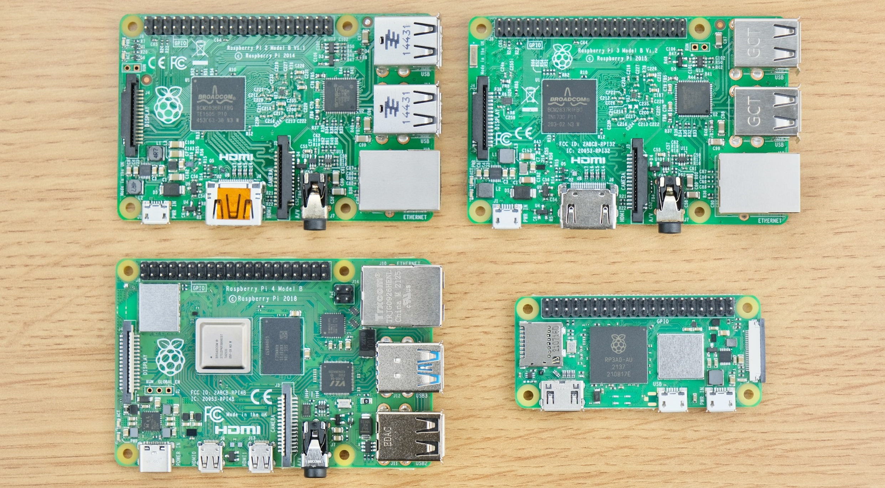
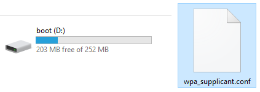
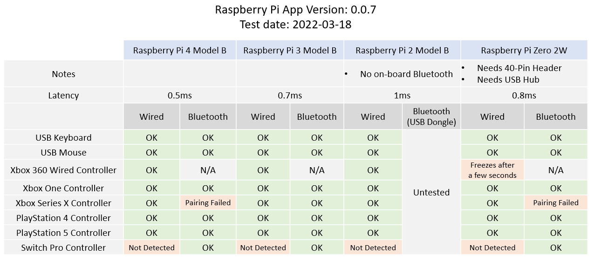

# Getting Started with USB4VC

[Get USB4VC](https://www.tindie.com/products/dekuNukem/usb4vc-usb-inputs-on-retro-computers/) | [Official Discord](https://discord.gg/HAuuh3pAmB) | [Table of Contents](#table-of-contents)

------

Thank you very much for getting USB4VC! Here is a short guide on getting started.

Please note that at the code is most likely NOT 100% bug free at the moment, so if you run into any issues, [do get in touch](#questions-or-comments) so I can try fixing it!

## Pick a Raspberry Pi

* USB4VC is designed for **Raspberry Pi 1/2/3/4 Model B**.

* Any RPi with a **40-pin header** *should* work, although **Model B/B+** is preferred.

* No need to get the latest model, even the earliest RPi B+ is plenty fast enough.

## Prepare SD card

You need a Micro SD card **at least 4GB** in size. A fast card will reduce boot time.

[Download the latest boot image here](https://github.com/dekuNukem/USB4VC/releases/latest), expand the zip file.

Burn the image to your SD card. I use [Rufus](https://rufus.ie/en/), which is free and open-source. [Etcher](https://www.balena.io/etcher/) is another cross-platform option.

Select your SD card, then the image file, then press `START` to begin writing.

## (Optional) Set up WiFi

After writing the SD card, go to the drive named `boot`, and open up `wpa_supplicant.conf` with a **proper text editor**:

Edit the file with your WiFi information. You can find your [WiFi country code here.](https://www.arubanetworks.com/techdocs/InstantWenger_Mobile/Advanced/Content/Instant%20User%20Guide%20-%20volumes/Country_Codes_List.htm)

If the file doesn't exist, [download a new one](https://github.com/dekuNukem/USB4VC/raw/master/resources/wpa_supplicant.zip), unzip, put it under `boot`, and update the information as above.

## Kit Assembly

Insert the SD card in your Raspberry Pi. Then [See this guide](/kit_assembly.md) to put everything together.

## Power Considerations

A **high-quality power supply** is very important! It should provide **5 Volts** and at least **2 amps** of current.

An inadequate supply can result in failure to boot, unstable operation, glitches, and SD card corruption.

Check the cable too! Cheap ones tends to have unreliable connections and large voltage drops.

## Protocol Card Overview: IBM PC

Let's take a quick look:

* Cables can be purchased in [my Tindie store](https://www.tindie.com/products/dekuNukem/usb4vc-usb-inputs-on-retro-computers/) (and of course other places).

* PS/2 keyboard and mouse need a **male to male** PS/2 cable.

* XT and AT keyboards need a **PS/2 female to AT male** adapter.

* The 9-Pin serial mouse requires a **female-to-female straight-through** cable.

* The 15-Pin gameport requires a **male-to-male** cable.

* DFU button is used for firmware updates.

## Protocol Card Overview: Apple Desktop Bus (ADB)

* A **male to male** 4-Pin mini-DIN cable is needed. S-Video cable works!

* You can use either ADB ports, and the other for daisy-chaining.

* Press the ADB Power button to turn on.

* ADB Power Button can also be activated from the microcontroller.

## Cable Connection

**Keep everything OFF for now!**

Using the appropriate cable, connect the desired port from Protocol Card to your computer.

Most retro peripherals are **NOT hot pluggable**, so make sure **all cables are connected before using!**

Also plug in any USB Keyboard, Mouse, and Gamepad into the Raspberry Pi.

If using Bluetooth, we can pair it later.

## Powering On

With cables connected, power up USB4VC with a USB-C cable.

You can do it from Baseboard, Protocol Card, or even RPi itself. All will work!

**Always turn on USB4VC BEFORE the computer!**

Protocol card will power up instantly and start talking with the retro computer, while Raspberry Pi takes a few seconds to boot up.

After a little while, the OLED screen should light up, showing **home screen**:

Press `+` or `-` to switch pages, and `enter` button to enter the submenu.

## Protocol Setup

Looking at home screen, if displayed protocol is what you want, you're good to go!

Otherwise, press `Enter` button to go to the submenu, and use `Enter` button to adjust protocols, mouse sensitivity, and gamepad linearity.

It is recommended to leave the sensitivity adjustments at default, and change them inside the OS or game first. Only do it on USB4VC if that's not possible.

## Pair Bluetooth

Select "Pair Bluetooth":

Put your device in Pairing mode, and press enter to start scanning.

After a while, a list of found devices is shown. If your device does not appear, try scanning again.

Use `+` / `-` to select one, and `enter` button to pair.

Pairing result will be shown. From my experience Bluetooth Mouse/Keyboards are usually fine, but Bluetooth gamepads can be a bit temperamental sometimes. If error occurs, try rebooting the BT device and/or USB4VC.

## Try it out!

With protocol selected, and everything connected, time to power on the computer!

If everything goes well, you should be able to use it as normal, now with USB inputs!

Please **do keep reading** for more information though 😅!

## Using Gamepads

Currently, USB4VC officially supports the following controllers:

* Xbox 360 / Xbox One / Xbox Series X

* PlayStation 4 / PlayStation 5

In my testing, gamepad compatibility seems to depends on the RPi models:

* **Raspberry Pi 3 Model B** seems to be the most compatible.

* If pairing fails, remove the BT device in the menu, reboot USB4VC, and try again.

* Multiple controllers will work at the same time, although sometime their outputs might compete with each other.

-----

Once connected, you can enable `15-Pin Gamepad` Protocol on IBM PC Card, and it should behave like a generic gamepad with **4 buttons and 4 analog axes**.

With **officially supported controllers**, the mapping is:

* 4 face buttons to 4 gameport buttons

* Left and right shoulder button to gameport button 3 & 4.

* Left Stick to gameport Joystick 1.

* Right Stick to gameport Joystick 2.

* Left & Right Analog Triggers to Joystick 2 Y-Axis.

Unsupported USB controllers might still work, but the default mapping might be wonky.

## Custom Gamepad Mapping

You can also create your own USB Gamepad mapping so suit your exact needs.

You can even have it **control mouse and keyboard**, in order to play games that did not have native gamepad support!

[Download the configurator](https://github.com/dekuNukem/usb4vc-configurator/blob/master/README.md) and follow the instruction to set it up.

## Joycheck DOS Program

You can [download this DOS program](https://github.com/dekuNukem/USB4VC/raw/master/resources/joytest.zip) to visualize what the gamepad is doing, great for troubleshooting! Found on this [vogons thread](https://www.vogons.org/viewtopic.php?p=187168#p187168).

* It's OK if the value is slightly off. Games will calibrate before starting anyway.

* Careful with pressing keyboard keys, it might mess up the display.

## Software Updates

Connect RPi to internet. You can [set up WiFi](#optional-set-up-wifi), or plug in an Ethernet cable.

Then simply select `Internet Update` in main menu. It will update source code and P-Card firmware to latest version.

## Tinkering Guide / Making Your Own Protocol Card / Technical Details

[Click me!](technical_notes.md)

## Powering Off/On

You can turn off/reboot the Raspberry Pi by pressing the `POWER OFF` button.

When the RPi is off, you can press `POWER ON` button to turn it back on.

## Known Issues

Here are a couple of bugs and issues that I am aware of, and the corresponding comments and remedies.

#### Boot Time

* Currently it takes about 17 seconds to boot with a decent SD card.

* Would be great if it's faster.

* Might look into disabling some services to speed it up.

* [Let me know](#questions-or-comments) if you'd like to help!

#### 15-Pin Gameport Power Backfeeding

* If USB4VC is unpowered, turning on the PC seems to back-feed power through the 15-pin gameport via the digital potentiometer.

* I haven't noticed any apparent damage, but it's probably not a good idea.

* Make sure to power on USB4VC **BEFORE** the computer. (this is what you should do anyway)

#### ADB Collision Resolution

* ADB collision resolution has not been fully implemented yet.

* Issues might arise **ONLY IF** you daisy-chain additional ADB devices **of the same type** **AND** use them **at the same time**.

* Not a high-priority bug, might work on it when I have time.

## Questions or Comments?

Feel free to ask in official [Discord Chatroom](https://discord.gg/HAuuh3pAmB), raise a [Github issue](https://github.com/dekuNukem/USB4VC/issues), [DM on Twitter](https://twitter.com/dekuNukem_), or email `dekunukem` `gmail.com`!

## Table of Contents

[Main page](README.md)

[(Youtube Video) USB4VC in Action](https://www.youtube.com/watch?v=54sdPELuu4g)

[Getting Started Guide](getting_started.md)

[Kit Assembly Guide](kit_assembly.md)

[Tinkering Guide / Make Your Own Protocol Card / Technical Notes](technical_notes.md)

[Kickstarter Acknowledgements](kickstarter_info.md)

