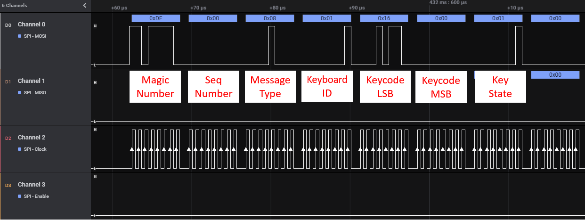

# USB4VC Technical Notes / Make Your Own Protocol Card

[Get USB4VC](https://www.kickstarter.com/projects/dekunukem/usb4vc-usb-inputs-on-retro-computers) | [Official Discord](https://discord.gg/HAuuh3pAmB) | [Getting Started](getting_started.md) | [Table of Contents](#table-of-contents)

-----

This document contains technical information about how USB4VC works. Please **read the whole article** if you're planning to make your own Protocol Cards.

## Linux Input Event Codes

First of all, how does USB4VC read from KB/Mouse/Gamepads in the first place?

The answer is Linux **Input Event Codes**. Here's a very simplified description:

* Connected input devices show up in `/dev/input` as files:

```
$ ls /dev/input/
event0  event1  event2  mice  mouse0  mouse1
```

* Reading from one of those files returns input events. Try `cat /dev/input/mice`!

* On RPi, **16 Bytes** are returned each time there is an event. They are arranged as follows:

| Byte  | Name        |
|-------|-------------|
| 0-7   | Timestamp   |
| 8-9   | Event Type  |
| 10-11 | Event Code  |
| 12-15 | Event Value |

* A list of all Event Type, Code and Values [can be found here](https://github.com/torvalds/linux/blob/master/include/uapi/linux/input-event-codes.h), set a bookmark if you're making your own P-Card!

* Keyboard keys and mouse/gamepad buttons are **EV_KEY** type, mouse moments are **EV_REL** (relative) type, and joystick movements are **EV_ABS** (absolute) type.

* Once you know the Event Type, you can look up Event Code to see which key/button/axes is being updated.

* Event Value will be 1 (pressed) or 0 (released) for buttons, and a signed value for relative or absolute axes.

* [Here's a good article](https://thehackerdiary.wordpress.com/2017/04/21/exploring-devinput-1/) that goes into a bit more details.

* You can install `evtest` and see what your device is returning in real time.

* USB4VC reads those events from all input devices, processes them, and send them out to the Protocol Card.

## Hardware Pinout

The Protocol Card connector directly maps to the Raspberry Pi Header, although the pins are flipped around.

Most pins are already in use:


A few comments:

* Protocol Card and OLED screen shares the same SPI bus, with different CS of course.

* Pin 22 is used to reset the P-Card, pin 32 for putting the microcontroller in bootloader mode for firmware updates.

* Pin 3 and 5 are connected to microcontroller I2C lines for firmware updates.

* A CH340 TTL-Serial-to-USB chip converts RPi serial (Pin 8 and 10) to USB-C on the Baseboard, currently unused.

* Pin 36 is P-Card-to-Baseboard interrupt pin, details in next section.

* 5V current should not exceed 2A.

* 3.3V current should not exceed 600mA.

## SPI Communication Protocol

Raspberri Pi communicates with Protocol Card through SPI. [Here's a quick introduction](https://www.circuitbasics.com/basics-of-the-spi-communication-protocol/) if you're unfamiliar.

RPi is master, P-card is slave. **Mode 0** is used (CPOL and CPHA both 0), **SCLK is 2MHz**.

RPi and P-Card communicates via **fixed-length 32-byte packets**.

Detailed description of messaging protocol [can be found in this document](https://docs.google.com/spreadsheets/d/e/2PACX-1vTDylIwis3GZrhakGK0uXJGc_SAZ_QwySmlMfZXpSdFDH6zoIXs1kHX7-4wUTeShZth_n6tJH8l3dJ3/pubhtml#), note that there are **multiple pages**.

Here is a sample capture of pressing `U` on the keyboard:


* 32 Bytes are sent in a single CS activation.

* SCLK is 2MHz, the entire transmission take around 290uS.

Here is a close-up of the first few bytes:



Compare to the [keyboard tab in the document](https://docs.google.com/spreadsheets/d/e/2PACX-1vTDylIwis3GZrhakGK0uXJGc_SAZ_QwySmlMfZXpSdFDH6zoIXs1kHX7-4wUTeShZth_n6tJH8l3dJ3/pubhtml#):


## Sample SPI Message Captures

More **sample captures** [can be found here](https://github.com/dekuNukem/USB4VC/tree/master/captures/diy_samples).

Click one and press `Download`.

Open with [Saleae Logic app](https://www.saleae.com/downloads/).

## Latency Information

Input latency can be introduced during all stages of input chain. Using keyboard as example, we have:

* Step 1: Switch physically depressed

* Step 2: Keyboard sends out event on USB/Bluetooth

* Step 3: Raspberry Pi processes the event and informs Protocol Card

* Step 4: Protocol Card sends out the keystroke to retro computer

* Step 5: Retro computer responds to the keystroke.

The part we're interested in is **Step 3 and 4**, as any time spent here is the additional delay from USB4VC.

To accurately measure the delay, I used a logic analyzer connecting to keyboard USB lines and PS/2 output on the IBM PC Protocol Card. Here is the delay in action:


From the keystroke appearing on USB, to keystroke appearing on PS/2, it took 487 *microseconds*.

Zoomed out capture with multiple keypresses:


I tested out different generations of Raspberry Pis, and here is the result:

| RPi Generation | Avg. Latency |
|----------------|---------|
| 2              | 1ms     |
| 3              | 0.63ms  |
| 4              | 0.5ms   |

You can find the [capture files here](captures/latency), open with [saleae app](https://www.saleae.com/downloads/), search `PID ACK` for USB input events, more info [in this video](https://www.youtube.com/watch?v=wdgULBpRoXk)

## Developing your own Protocol Card

USB4VC will send out keyboard and mouse event on SPI regardless of whether a protocol card is inserted or not. Although it will display appropriate options for switching protocols if the protocol card ID is recognized.

SPI Format, AVR based arduino probably wont work, suggested to use STM32, include link.

RPi Header pinout, explain what each pin does.

Current limits etc.

## Questions or Comments?

Feel free to ask in official [Discord Chatroom](https://discord.gg/HAuuh3pAmB), raise a [Github issue](https://github.com/dekuNukem/USB4VC/issues), [DM on Twitter](https://twitter.com/dekuNukem_), or email `dekunukem` `gmail.com`!

## Table of Contents

[Main page](README.md)

[(Youtube Video) USB4VC in Action](https://www.youtube.com/watch?v=54sdPELuu4g)

[Getting Started Guide](getting_started.md)

[Kit Assembly Guide](kit_assembly.md)

[Technical Notes](technical_notes.md)

[Launch Plan / Kickstarter Info](kickstarter_info.md)

